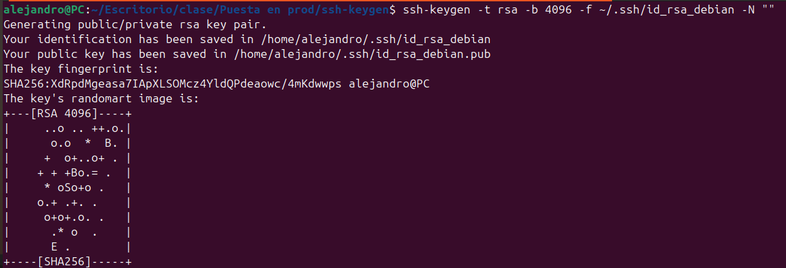
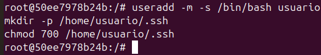
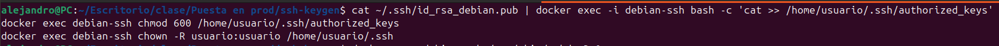
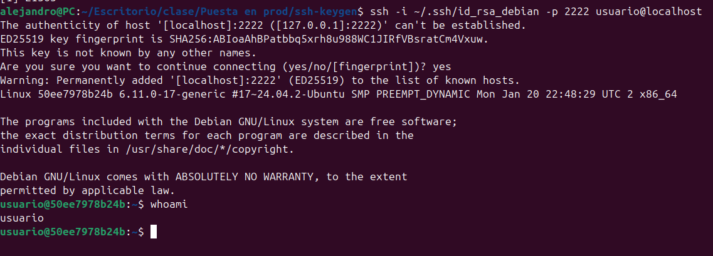

# ssh-keygen
Alejandro Díaz Barea

Fecha : 27-02-2025

## 1 Generar claves SSH con ssh-keygen

En tu máquina local, ejecuta:

```bash
ssh-keygen -t rsa -b 4096 -f ~/.ssh/id_rsa_debian -N ""
```

Esto generará dos archivos:

    ~/.ssh/id_rsa_debian (clave privada)
    ~/.ssh/id_rsa_debian.pub (clave pública)



## 2 Crear un contenedor Debian sin personalización previa

```hash
docker run -dit --name debian-ssh --rm -p 2222:22 debian:latest bash
```

## 3 Instalar y configurar el servidor SSH en el contenedor

1. Accede al contenedor:

    ```bash
    docker exec -it debian-ssh bash
    ```

2. Dentro del contenedor, instala el servidor SSH:

    ```bash
    apt update && apt install -y openssh-server
    ```


3. Configura el servicio SSH:

    ```bash
    mkdir /var/run/sshd
    echo 'PermitRootLogin yes' >> /etc/ssh/sshd_config
    ```

    

4. Crea un usuario para acceder vía SSH:

    ```bash
    useradd -m -s /bin/bash usuario
    mkdir -p /home/usuario/.ssh
    chmod 700 /home/usuario/.ssh
    ```

    


5. Copia la clave pública al contenedor (desde la máquina host):

    ```bash
    cat ~/.ssh/id_rsa_debian.pub | docker exec -i debian-ssh bash -c 'cat >> /home/usuario/.ssh/authorized_keys'
    docker exec debian-ssh chmod 600 /home/usuario/.ssh/authorized_keys
    docker exec debian-ssh chown -R usuario:usuario /home/usuario/.ssh
    ```

    


6. Inicia el servicio SSH:

    ```bash
    docker exec debian-ssh /usr/sbin/sshd -D &
    ```

## 4 Acceder al contenedor mediante SSH


