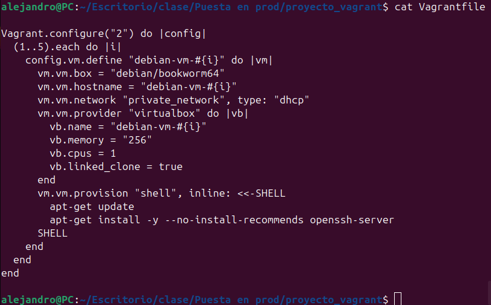
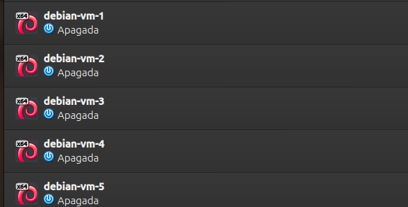

# VAGRANT
Alejandro Díaz Barea

Fecha : 27-02-2025


## 1. Introducción

Guíua sobre la configuración y uso de automatizar máquinas usando Vagrant y VirtualBox. Se han creado cinco máquinas virtuales Debian con SSH instalado

## 2. Requisitos Previos

Los requisitos son:

- **Vagrant**: [https://developer.hashicorp.com/vagrant/downloads](https://developer.hashicorp.com/vagrant/downloads)
- **VirtualBox**: [https://www.virtualbox.org/wiki/Downloads](https://www.virtualbox.org/wiki/Downloads)

## 3. Estructura de el proyecto

```
proyecto_vagrant/
├── Vagrantfile
└── scripts/
    └── provision.sh
```

## 4. Contenido del Vagrantfile



## 5. Script de Provisionamiento

El archivo `provision.sh` se encarga de actualizar el sistema e instalar el servidor SSH:

```bash
#!/bin/bash
apt-get update
apt-get install -y --no-install-recommends openssh-server
```

## 6. Instrucciones de Uso

Para iniciar y gestionar las máquinas virtuales, se deben ejecutar los siguientes comandos:

- **Iniciar las máquinas virtuales:**
  ```bash
  vagrant up
  ```

- **Acceder a una máquina virtual:**
  ```bash
  vagrant ssh debian-vm-1
  ```

- **Detener las máquinas virtuales:**
  ```bash
  vagrant halt
  ```

- **Destruir las máquinas virtuales:**
  ```bash
  vagrant destroy
  ```


## 7. Conectarnos por ssh 

Como se puede ver nos podemos conectar por ssh a las máquinas 


Tambien se puede ver en el virtualbox las máquinas creadas (ahora las tengo apagadas)



